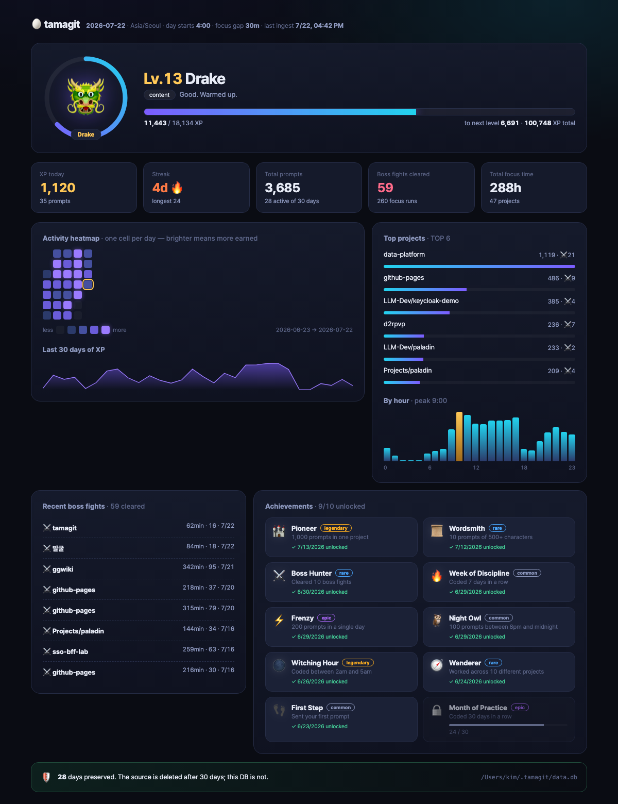

# 🥚 tamagit

> Claude Code 활동을 읽어, **코딩을 RPG로** 만든다.
> XP·연속기록·업적으로 펫이 자라나는 **로컬 우선** 도구. 런타임 의존성 0.



---

## 빠르게 돌려보기

```bash
node --disable-warning=ExperimentalWarning src/cli.ts        # 적재 + 대시보드 (기본)
npm start                                                    # 위와 동일
npm run stats                                                # 터미널 요약
npm run sync                                                 # 적재만
npm test                                                     # 44개 테스트
```

대시보드는 `http://127.0.0.1:4173`. 외부로 열지 않는다(127.0.0.1 바인딩).

**요구사항: Node ≥ 22.18** — 내장 타입 스트리핑과 `node:sqlite`를 쓰기 때문에 빌드 단계도, 런타임 패키지도 없다.
(`typescript`/`@types/node`는 타입체크용 devDependency일 뿐이다.)

---

## 이 도구가 존재하는 이유

`~/.claude/history.jsonl`은 **30일 뒤 사라진다**. 실제로 파일에는 30일치 미만만 남아 있다.
이 도구는 그걸 매 실행마다 로컬 SQLite로 퍼 나른다. 원본이 지워져도 레벨과 스트릭은 남는다.

```
🛡  28일치 보존 중. 원본은 30일 뒤 사라지지만 이 DB는 남는다.
    ~/.tamagit/data.db
```

한 줄이 프롬프트 한 건이고, 필드는 `display` / `pastedContents` / `timestamp` / `project` / `sessionId`
다섯 개다. `timestamp`는 epoch **ms**이고 파일은 append-only 오름차순이다.
`(sessionId, ts)` 조합이 유일해서 멱등 적재 키로 쓴다.

---

## 게임 규칙

### XP

| 항목 | 값 |
|---|---|
| 프롬프트 기본 | 10 XP |
| 길이 보너스 | `8 × ln(1 + 글자수/20)` |
| 멀티라인 | +5 |
| 붙여넣기 첨부 | +6 |
| 슬래시/뱅 커맨드 | ×0.5 |
| 몰입 구간 완주 | +15 |
| **보스전 클리어** | **+200** |
| 스트릭 보너스 | 그날 소계의 `(연속일수-1)%`, 최대 +30% |

길이 보상이 **로그 스케일**인 이유: 실제 프롬프트 길이는 몇 글자짜리 추임새(`"계속"`, `"진행시켜"`)부터
천 자 넘는 설계 문단까지 두 자릿수 배로 벌어진다. 선형이면 장문 하나가 하루를 끝내버리고,
균일하면 추임새와 설계 프롬프트가 같은 값이 된다.
현재 곡선은 4자 12 XP, 36자 18 XP, 1,184자 43 XP다.

레벨업에 필요한 XP는 `500 × 레벨^1.4`. 하루 130 프롬프트를 꾸준히 쓰면 한 달에 Lv.13 언저리.

### 하루 경계 — 새벽 4시

`03:59`의 활동은 **전날**로 귀속된다. 밤 20~23시 활동이 하루의 5분의 1을 차지하는 게 보통이라,
자정 경계를 쓰면 밤샘 코딩이 두 날로 쪼개지면서 스트릭 체감이 망가진다. `--day-start 0`으로 끌 수 있다.

### 몰입 구간과 보스전

**몰입 구간(run)** = 같은 세션 안에서 프롬프트 간격이 **30분 이내**로 이어진 덩어리.
**보스전** = 한 구간이 **60분 이상 AND 프롬프트 15건 이상**.

세션을 통째로 쓰지 않는 이유: 24시간 넘게 열려 있는데 프롬프트는 열댓 개뿐인 세션이 흔하다.
총 경과시간은 자리를 비운 시간까지 포함해서 몰입의 척도가 못 된다.

### 업적 10종

👣 첫 발자국 · 🔥 일주일의 규율 · 🏔️ 한 달의 수행 · 🦉 야행성 · 🌑 마의 시간
⚔️ 보스 헌터 · 📜 장인의 문장 · 🧭 방랑자 · ⚡ 폭주 · 🏰 개척자

달성 시각은 **실제로 조건을 만족한 그 시점**으로 소급 계산한다 (도구를 오늘 처음 켜도 과거 날짜가 찍힌다).

### 펫

🥚 알(Lv.1) → 🐣 해츨링(3) → 🦎 코드 리저드(6) → 🐲 드레이크(11) → 🐉 코드 드래곤(19) → ✨ 성좌룡(31)

오늘 활동량과 스트릭에 따라 기분이 바뀐다. 스트릭이 오늘 끊길 상황이면 펫이 먼저 알려준다.

---

## 옵션

```
--history <path>   원본 경로       (기본 ~/.claude/history.jsonl)
--db <path>        DB 경로         (기본 ~/.tamagit/data.db)
--tz <zone>        시간대          (기본 Asia/Seoul)
--day-start <h>    하루 시작 시각  (기본 4)
--idle <min>       몰입 구간 분리  (기본 30)
--port <n>         대시보드 포트   (기본 4173)
--json             stats 를 JSON 으로
```

---

## 포맷이 깨지면

Claude Code의 내부 포맷은 버전마다 바뀐다. 그래서 파서는:

- 라인 단위로 실패를 격리하고, **버린 줄을 반드시 카운트해서 노출한다** (조용히 삼키면 XP가 조용히 틀어진다)
- 모르는 신규 필드는 무시하고 통과시킨다
- `timestamp`가 초 단위로 바뀌어도 ms로 보정한다

테스트에 **실제 `history.jsonl`을 감시하는 회귀 검사**가 들어 있다.
필드 조합이 알려진 형태와 달라지면 `npm test`가 터진다 = 파서를 고치라는 신호다.
(`~/.claude/history.jsonl`이 없는 환경에서는 자동으로 skip된다.)

---

## 구조

```
src/
  cli.ts            엔트리 (sync / stats / serve)
  server.ts         내장 http 서버, 의존성 없음
  terminal.ts       터미널 렌더러
  web/index.html    대시보드 (인라인 CSS/JS, 외부 요청 0)
  core/
    config.ts       설정 · 게임 규칙 상수
    clock.ts        하루 경계 · 시간대
    history.ts      history.jsonl 파서 (방어적)
    xp.ts           XP · 레벨 곡선
    runs.ts         몰입 구간 · 보스전 판정
    streak.ts       연속기록
    achievements.ts 업적 10종
    pet.ts          펫 진화 · 기분
    db.ts           SQLite 스키마 · 멱등 적재
    sync.ts         적재 파이프라인
    stats.ts        대시보드 집계
    core.test.ts    44 테스트
```

---

## 알려진 한계

- **총 몰입 시간은 낙관적이다.** 유휴 30분 미만 간격은 전부 "활동 중"으로 계산하므로, 29분 자리를 비워도 몰입에 포함된다. 보스전 판정에는 건수 조건(15건)이 함께 걸려 있어 영향이 적지만, 상단 타일의 총 몰입 시간은 상한으로 읽는 게 맞다.
- 하루 경계 시프트는 DST가 있는 시간대에서 전환일 하루만 1시간 어긋난다. 한국은 해당 없음.
